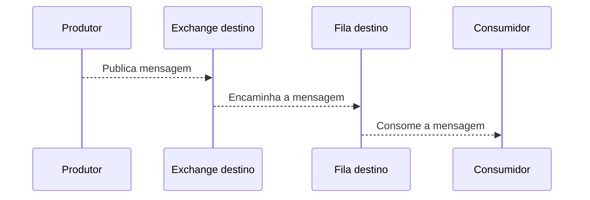
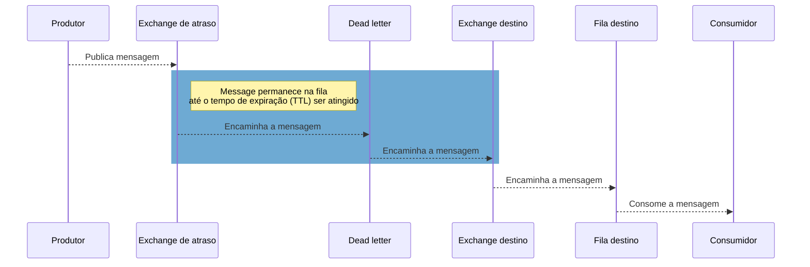

# Delayed-Rabbit 🐰🕓

Implementação de uma solução para consumir mensagens com "atraso" utilizando [RabbitMQ](https://www.rabbitmq.com/).

Foi utilizada a solução sugerida na documentação do CloudAMQP ([delayed-messages](https://www.cloudamqp.com/docs/delayed-messages.html)) que combina as funcionalidades de [message TTL](https://www.rabbitmq.com/ttl.html) e [dead-lettering](https://www.rabbitmq.com/dlx.html).

A solução consiste em adicionar uma exchange intermediária entre o produtor e a exchange destino que funciona como uma "fila de espera". Para fins de exemplo, vamos chamar essa exchange intermediaria de "exchange de atraso".

Na exchange de atraso vamos configurar um tempo de expiração (TTL) para as mensagens e uma fila de mensagens mortas (Dead-letter). A fila de mensagens mortas será responsável por reencaminhar as mensagens para a exchange destino. Para a exchange de atraso não devem existir outras filas além da fila de mensagens mortas.

Desde modo toda mensagem publicada permanecerá na exchange de atraso até que tempo de expiração seja atingido. Após a expiração da mensagem ela é encaminhada para a fila de mensagens mortas que irá reencaminha-la a para a exchange destino.

#### Cenário sem atraso

#### Cenário com atraso

