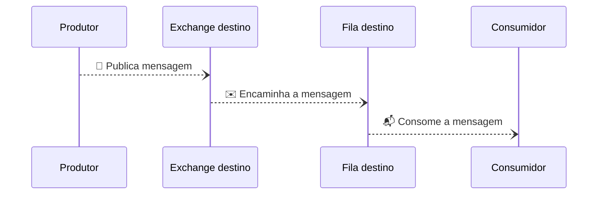
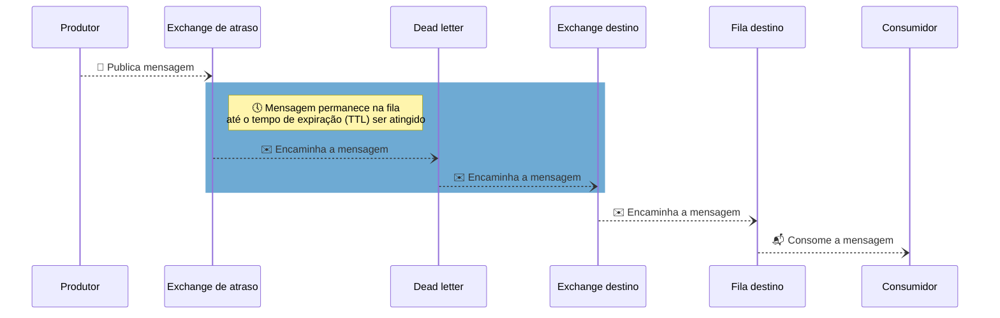
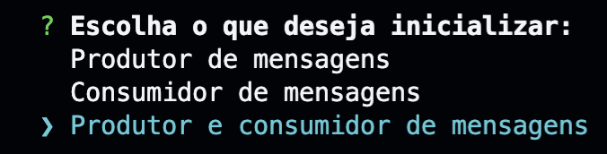
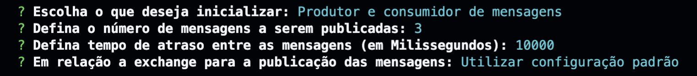

# Delayed-Rabbit 🐰🕓

Implementação de uma solução para encaminhar mensagens com "atraso" utilizando o [RabbitMQ](https://www.rabbitmq.com/). Ou seja, essa solução é útil em um cenário onde não seja desejado consumir as mensagens de uma fila imediatamente e seja necessário adicionar um tempo de atraso para encaminhar as mensagens.

## Solução

Foi utilizada a solução sugerida na documentação do CloudAMQP ([delayed-messages](https://www.cloudamqp.com/docs/delayed-messages.html)) que combina as funcionalidades de [message TTL](https://www.rabbitmq.com/ttl.html) e [dead-lettering](https://www.rabbitmq.com/dlx.html).

A solução consiste em adicionar uma exchange intermediária, entre o produtor e a exchange destino, que deve funcionar como uma "fila de espera".

Para fins de exemplo, vamos chamar a exchange intermediaria de "exchange de atraso". Na exchange de atraso vamos configurar um tempo de expiração (TTL) para as mensagens e uma fila de mensagens mortas (Dead-letter). A fila de mensagens mortas será responsável por reencaminhar as mensagens para a exchange destino.

Desde modo toda mensagem publicada permanecerá na exchange de atraso até que tempo de expiração seja atingido. Após a expiração da mensagem ela é encaminhada para a fila de mensagens mortas que irá reencaminha-la para a exchange destino.

## Diagramas

### Cenário sem atraso



### Cenário com atraso



## Executando a aplicação

Tenha instalado [NodeJS](https://nodejs.org) ou [Docker](https://docs.docker.com) na sua máquina.

É possível substituir as configurações padrões criando um arquivo `.env`, seguindo o exemplo do arquivo `.env.example`.
As seguintes configurações podem ser definidas:
* App:
  * `APP_NAME` Nome da aplicação
* Logger ([Pino](https://github.com/pinojs/pino))
  * `LOG_LEVEL` Especifica o nível dos logs a serem exibidos `fatal|error|warn|info|debug|trace|silent`
  * `LOG_PRETTY_PRINT` Ativa ou desativa formatação dos logs `true|false`
* RabbitMQ:
  * `RABBITMQ_URL` URL para conexão com o rabbitMQ

### Inicializando a aplicação com Docker Compose

```shell
docker compose run app
```

**Nota**: Neste modo de inicialização serão inicializados localmente containers para a aplicação e para o [RabbitMQ](https://www.rabbitmq.com/). Desta maneira não é necessário configurar o RabbitMQ de forma independente.

**Nota**: Para encerrar a execução da aplicação e o RabbitMQ execute o seguinte comando:

```shell
docker compose down
```

### Inicializando a aplicação com NodeJS

```shell
npm i
npm run build
npm run start
```

**Nota**: _Neste modo de inicialização é necessário rodar de forma independente o RabbitMQ e definir a valor para a variável de ambiente `RABBITMQ_URL` no arquivo `.env`_.

### Definindo as configurações para o envio das mensagens

Após inicializar a aplicação siga as instruções apresentadas no console para definir as configurações para o envio das mensagens:

<center>
  
  <p><i>Figura 1:  Menu principal</i></p>
</center>
<br>
<center>
  
  <p><i>Figura 2:  Menu de configurações</i></p>
</center>

## Comandos

Os comandos a seguir podem ser executados em um ambiente com o [NodeJS](https://nodejs.org) instalado e após instalar as dependências do projeto (`npm i`).

Comando   | Descrição
--------- | ------
`npm run start` | Inicializa aplicação
`npm run build` | Executa o build do projeto transpilando o código TypeScript para JS
