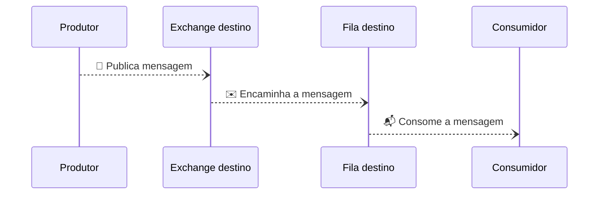
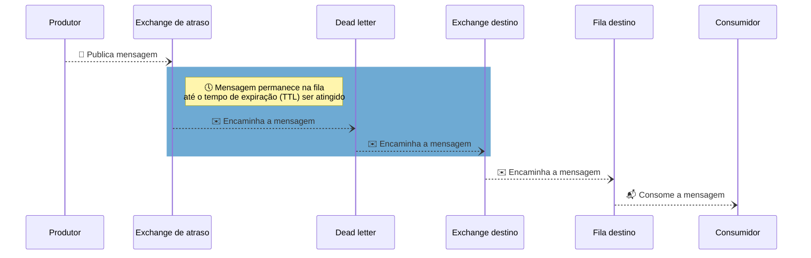

# Delayed-Rabbit 🐰🕓

Implementação de uma solução para encaminhar mensagens com "atraso" utilizando o [RabbitMQ](https://www.rabbitmq.com/). Ou seja, essa solução é útil em um cenário onde não seja desejado consumir as mensagens de uma fila imediatamente e seja necessário adicionar um tempo de atraso para encaminhar as mensagens.

## Solução

Foi utilizada a solução sugerida na documentação do CloudAMQP ([delayed-messages](https://www.cloudamqp.com/docs/delayed-messages.html)) que combina as funcionalidades de [message TTL](https://www.rabbitmq.com/ttl.html) e [dead-lettering](https://www.rabbitmq.com/dlx.html).

A solução consiste em adicionar uma exchange intermediária, entre o produtor e a exchange destino, que deve funcionar como uma "fila de espera".

Para fins de exemplo, vamos chamar a exchange intermediaria de "exchange de atraso". Na exchange de atraso vamos configurar um tempo de expiração (TTL) para as mensagens e uma fila de mensagens mortas (Dead-letter). A fila de mensagens mortas será responsável por reencaminhar as mensagens para a exchange destino.

Desde modo toda mensagem publicada permanecerá na exchange de atraso até que tempo de expiração seja atingido. Após a expiração da mensagem ela é encaminhada para a fila de mensagens mortas que irá reencaminha-la para a exchange destino.

## Diagramas

### Cenário sem atraso

### Cenário com atraso

